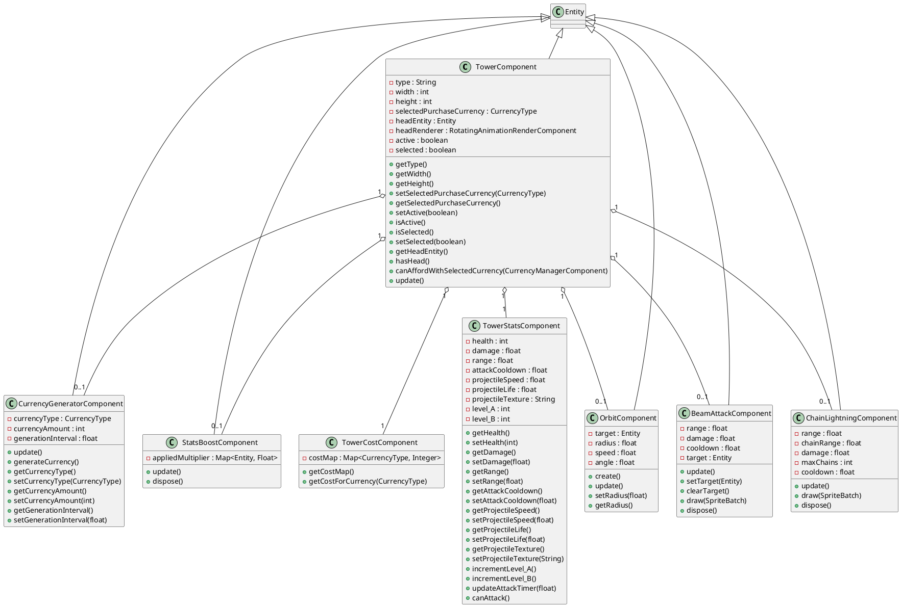

```plantuml
@startuml
class TowerComponent {
    - type : String
    - width : int
    - height : int
    - selectedPurchaseCurrency : CurrencyType
    - headEntity : Entity
    - headRenderer : RotatingAnimationRenderComponent
    - active : boolean
    - selected : boolean
    + getType()
    + getWidth()
    + getHeight()
    + setSelectedPurchaseCurrency(CurrencyType)
    + getSelectedPurchaseCurrency()
    + setActive(boolean)
    + isActive()
    + isSelected()
    + setSelected(boolean)
    + getHeadEntity()
    + hasHead()
    + canAffordWithSelectedCurrency(CurrencyManagerComponent)
    + update()
}

class TowerStatsComponent {
    - health : int
    - damage : float
    - range : float
    - attackCooldown : float
    - projectileSpeed : float
    - projectileLife : float
    - projectileTexture : String
    - level_A : int
    - level_B : int
    + getHealth()
    + setHealth(int)
    + getDamage()
    + setDamage(float)
    + getRange()
    + setRange(float)
    + getAttackCooldown()
    + setAttackCooldown(float)
    + getProjectileSpeed()
    + setProjectileSpeed(float)
    + getProjectileLife()
    + setProjectileLife(float)
    + getProjectileTexture()
    + setProjectileTexture(String)
    + incrementLevel_A()
    + incrementLevel_B()
    + updateAttackTimer(float)
    + canAttack()
}

class TowerCostComponent {
    - costMap : Map<CurrencyType, Integer>
    + getCostMap()
    + getCostForCurrency(CurrencyType)
}

class CurrencyGeneratorComponent {
    - currencyType : CurrencyType
    - currencyAmount : int
    - generationInterval : float
    + update()
    + generateCurrency()
    + getCurrencyType()
    + setCurrencyType(CurrencyType)
    + getCurrencyAmount()
    + setCurrencyAmount(int)
    + getGenerationInterval()
    + setGenerationInterval(float)
}

class StatsBoostComponent {
    - appliedMultiplier : Map<Entity, Float>
    + update()
    + dispose()
}

class OrbitComponent {
    - target : Entity
    - radius : float
    - speed : float
    - angle : float
    + create()
    + update()
    + setRadius(float)
    + getRadius()
}

class BeamAttackComponent {
    - range : float
    - damage : float
    - cooldown : float
    - target : Entity
    + update()
    + setTarget(Entity)
    + clearTarget()
    + draw(SpriteBatch)
    + dispose()
}

class ChainLightningComponent {
    - range : float
    - chainRange : float
    - damage : float
    - maxChains : int
    - cooldown : float
    + update()
    + draw(SpriteBatch)
    + dispose()
}

TowerComponent "1" o-- "1" TowerStatsComponent
TowerComponent "1" o-- "1" TowerCostComponent
TowerComponent "1" o-- "0..1" CurrencyGeneratorComponent
TowerComponent "1" o-- "0..1" StatsBoostComponent
TowerComponent "1" o-- "0..1" OrbitComponent
TowerComponent "1" o-- "0..1" BeamAttackComponent
TowerComponent "1" o-- "0..1" ChainLightningComponent

Entity <|-- TowerComponent
Entity <|-- BeamAttackComponent
Entity <|-- ChainLightningComponent
Entity <|-- OrbitComponent
Entity <|-- StatsBoostComponent
Entity <|-- CurrencyGeneratorComponent

@enduml
```

